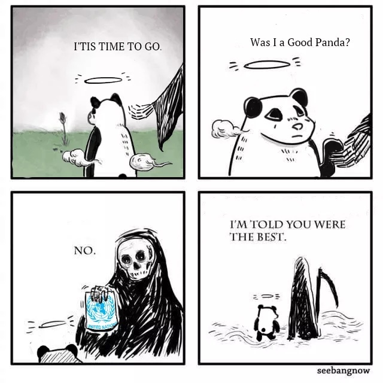

# nonstop-story

这是 nonstop-story 的**从代码到实物**课程仓库。

## 团队介绍

这是一个肝肝肝的团队

拥有大佬，我们并不迷茫（迷之自信）

## 成员介绍

[刘俊汐](https://github.com/Junxi5927/L)，一个不会编程的无助设计生

好好一个理科生被生活折磨成了文科生

毕凯斌，理科生被分到文科专业向转走......

[杨靖华](https://github.com/ShirakamiEmmmer)，技能树全部点歪的江湖气人（

## 仓库介绍

本仓库用于存放每一次课程的作业

已经创建第二次作业的文件夹

