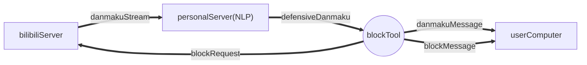
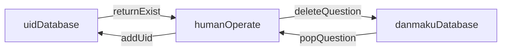

团队: Nonstop-Story

团队介绍: 
这是一个五人的团队，但是由于各种特殊原因，目前存活人员只有三人，由两位班里屈指可数的计算机大佬和一个不知道是当咸鱼好还是打酱油好的设计学徒组成。

|工作|人员|
|:---:|:---:|
|团队指导教师|李老师|
|技术顾问|王老师|
|技术人员|杨靖华|
|技术人员|曾韬|
|设计人员|刘俊汐|
|小组成员|李宁搏|
|小组成员|毕凯斌|

项目介绍: 
这是一个实时管理并处理 **Bilibili弹幕** 的程序

程序运行时界面用`Kotlin`编写

后端程序用`Python`编写

通过这个程序，我们可以做到净化弹幕，并多人在线管理发言名单

我们希望通过这个程序净化B站弹幕环境

同时帮助弹幕管理人员及时排除不良言论，处理不良言论的发表者

为我们心灵的窗户做好滤网，让网友们能够轻松享受弹幕文化。

通过这次作业，小组成员充分提高了自我学习能力，体会了在新程序开发中所经历的困难和艰辛，同时提高了团队合作能力。

图纸1（NLP版本）: 

图纸2（数据库版本）: 

制作过程记录: 

凿物网制作教程链接: 

附加功能: 
